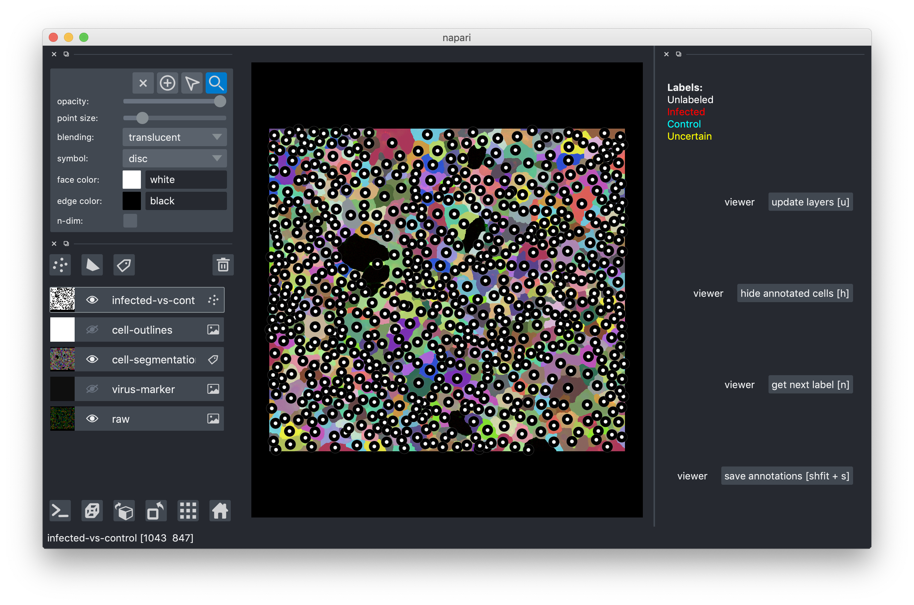
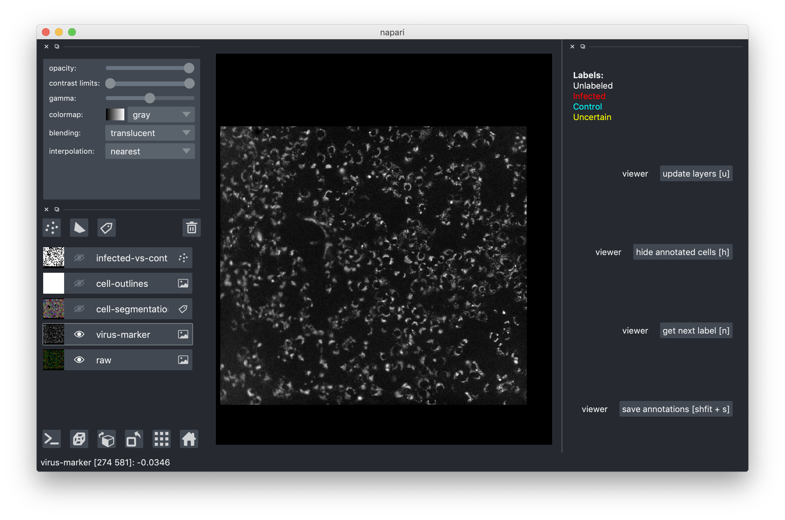
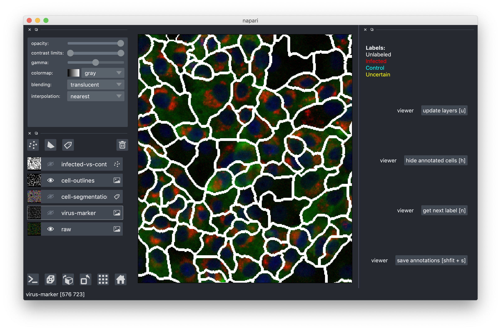
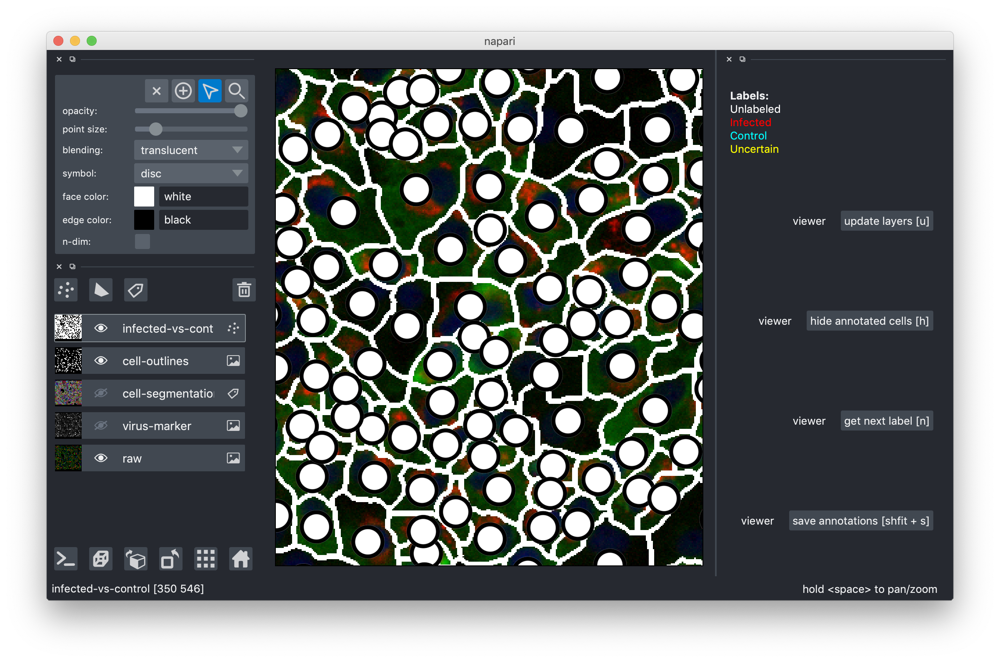
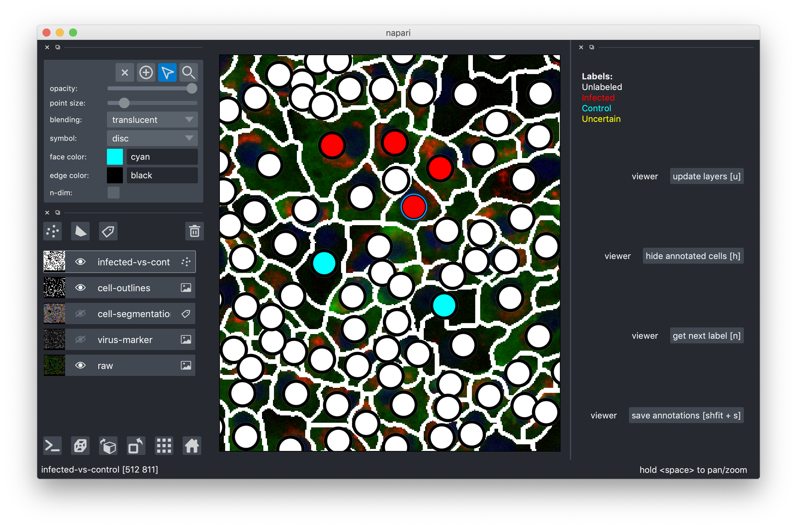
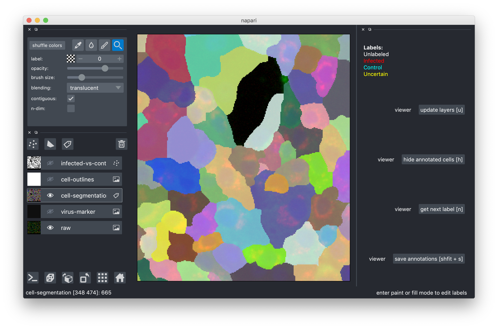
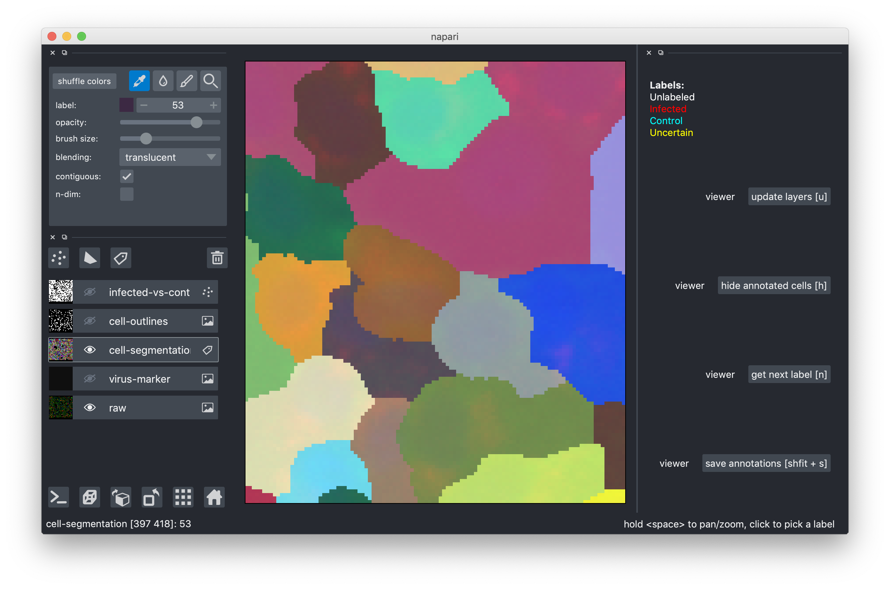

# napari-covid-if-annotations

Annotation Tool for immunofluorescence assay images

----------------------------------

## Getting Started

### The  aim of this software

It allows you to manually annotate 2D images of cells, starting from an exisitng and partially wrong cell segmentation. Two kinds of annotations are supported: 1) correcting the provided segmentation and 2) assigning one of the predefined labels to segmented cells. **We would greatly appreciate labels of both kinds!**


## Step-by-step guide

### Download the software

TODO describe and add link for mac image [Download windows](https://files.ilastik.org/covid-if-annotations-setup-0.0.1dev11.exe).

### Download an image to annotate

TODO annotate.embl.de

### Open the input image

Drag-and-drop the .h5 file you downloaded into the tool or use the File->Open menu item. After you do this, you should see an image like this:
 
The multi-colored overlay shows the preliminary cell segmentation we have obtained with our current pipeline. In the lower half of the left part of the window you see a list of displayed overlays, which you can turn on and off by clicking on the eye icon or configure using the controls in the upper left. 
The white dots in the middle of each cell show the label assigned to it. In the beginning, all cells are white, i.e. Unlabeled. If you start from an existing project, you will also see red("infected"), cyan("control") and yellow("uncertain") labels.

### Label cells

To understand whether a cell is infected you will need to look at the channel showing the virus marker. We saved it as a separate overlay, here is what you should see if you make it visible and turn off the rest:

Zoom in closer by scrolling and start inspecting indvidual cells. Turn off the segmentation overlay and turn on the cell outlines to see what's happening inside cells. Here is what it looks like:

The red  channel in the raw data corresponds to the virus-marker overlay, but we chose to also show it separately because it's so important for the infected/control decisions. 

Now, **get ready for labeling**: make the infected-vs-control overlay visible and active (click on the eye and also somewhere else on the rectangle with the "infected-vs-control" words. You should now see this layer high-lighted. Go to the topmost 4 buttons and activate the "mouse" one as shown here:

That's it, you can now click on the white circles to give them labels! If you click and nothing happens, make sure the mouse is activated as shown above! To get the next color in the list, just click again. Don't forget, the yellow label is there for the cells where you can't decide. Here are my results after a few clicks:

Keep going until you have all the cells labeled. **Don't forget to save your annotations frequently!** If you get really tired or bored and can't do the whole image, send us the partial result, that would already be very helpful!

TODO proper criteria for labeling the cells

### Correct cell segmentations
The segmentations you see here were produced by our current pipeline. They are automatic and thus not perfect. Here is what you do if you notice a segmentation error:

1. make the cell-segmentatioon overlay active by clicking on it. You should now see a different row of controls on the very top. 

Now the pipette is for the color picker, the drop for filling and the pen for drawing. 
2. locate the cell you want to correct and select its color with the color picker. In the example below, I will make the dark gray cell larger. Note, how the "label" field in the upper left configuration pane now shows the label I selected, by color and by numeric id.

3. select the pen tool and paint on top of other cells to re-assign their pixels to the cell whose color you picked. I painted and my cell got better (what do I know, I'm not a cell biologist. At least it's now different).

4. Now what if you want to paint a new cell that we missed? Press "n" on your keyboard to activate a new, unused label. Then paint your  new cell. Done!

### Reload saved results

TODO

### Upload your results

TODO


## For Developers

### Install from source

Set up a conda environment with all dependencies and activate it:

```
conda create -c conda-forge -n test-annotations napari scikit-image h5py pandas
conda activate test-annotations
```
Then install magicgui and this tool using pip:
```
pip install magicgui
pip install -e .
```

After installing the plugin, you can run
```
python launch.py
```
to launch the annotation tool. Drag and drop data to annotate onto the viewer.
Or you can start the tool with data already via:
```
python launch.py --path /path/to/data.h5
```

Example data is [available here](https://oc.embl.de/index.php/s/IghxebboVxgpraU).

## Keybindings:
- `u` update point and edge layer from the segmentation corrections and semantic annotations.
- `h` toggle visibility of already annotated segments.
- `.` cycle through the annotations for a selected point
- `t` toggle annotation cycling by mouse click (not working yet!)
- `Shift + s` save the current annotations (segmentation + infected-vs-control labels)


## Acknowledgements

This [napari] plugin was generated with [Cookiecutter] using with [@napari]'s [cookiecutter-napari-plugin] template.

<!--
Don't miss the full getting started guide to set up your new package:
https://github.com/napari/cookiecutter-napari-plugin#getting-started

and review the napari docs for plugin developers:
https://napari.org/docs/plugins/index.html
-->

## Contributing

Contributions are very welcome. Tests can be run with [tox], please ensure
the coverage at least stays the same before you submit a pull request.

## License

Distributed under the terms of the [MIT] license,
"napari-covid-if-annotations" is free and open source software
